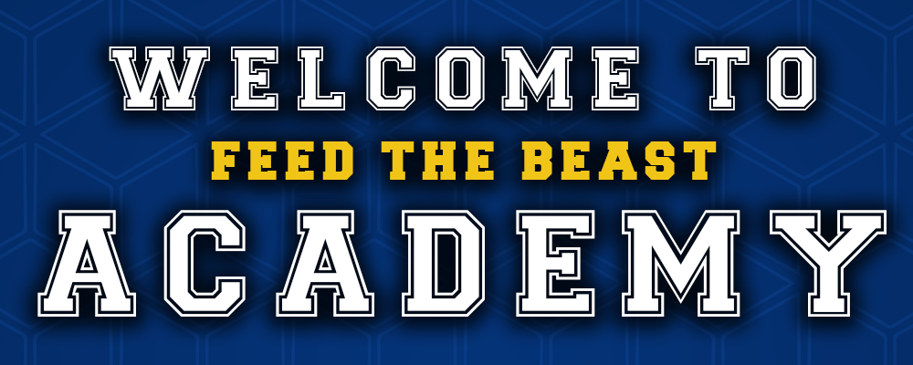
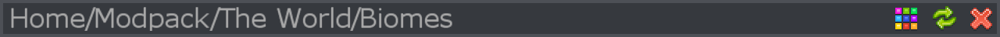
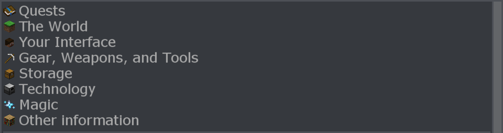

FTB Academy - это модпак, предназначенный для обучения новых игроков игре в модифицированном майнкрафте. Мы рассмотрим все важные концепции и самые популярные моды, чтобы вы могли использовать эти знания для игры в более сложные модпаки.

Если вы играете с кем-то еще, вы должны создать команду и присоединиться к ней. Это можно сделать, нажав кнопку «Моя команда» в левом верхнем углу вашего инвентаря.

В самом верху меню Руководства вы можете увидеть каталог страницы, на которой вы находитесь. Вы можете нажать на название предыдущих страниц, чтобы вернуться на эту страницу. Вы также можете нажать Backspace, чтобы вернуться на одну страницу назад.

Вы можете изменить тему, обновить руководство (что действительно полезно только для создателей модпаков) и закрыть руководство с помощью кнопок в правом верхнем углу. Вы также можете закрыть руководство, нажав E или Escape.

Прямо под этим вы можете увидеть доступные страницы, на которые вы можете перейти. Нажмите на название страницы, чтобы открыть ее.

На некоторые изображения можно навести курсор, чтобы увидеть дополнительный текст.

