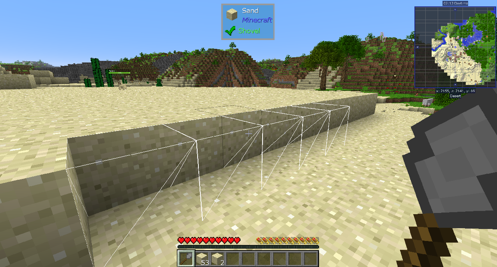
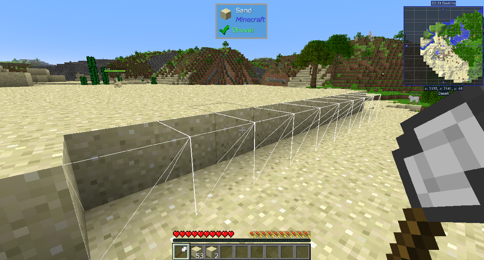
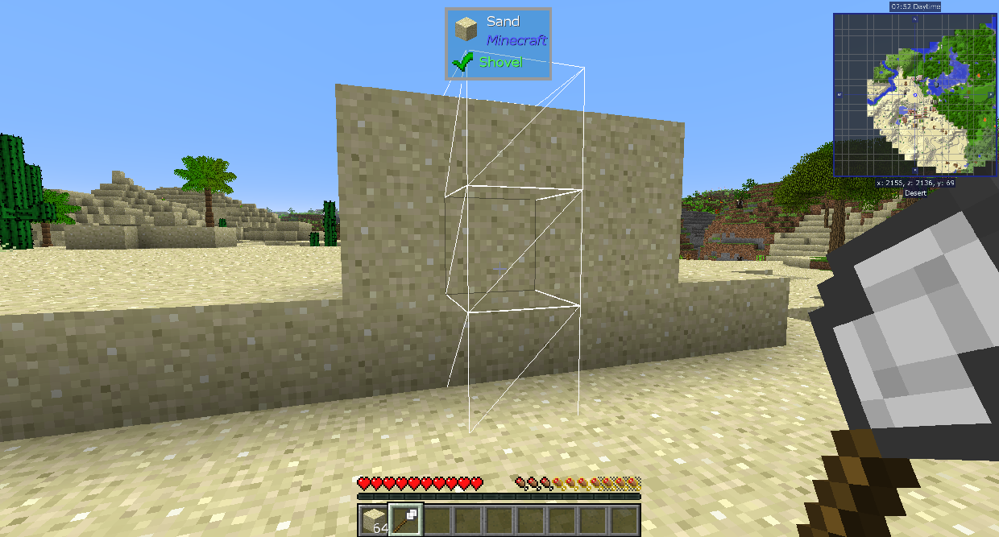
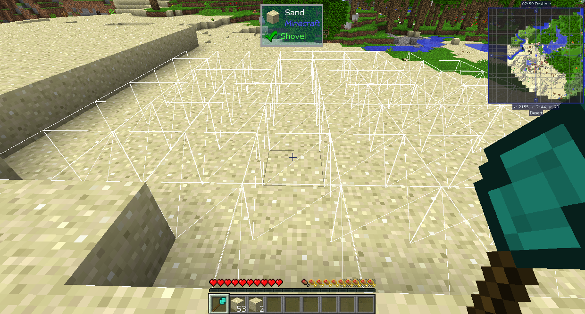

# Better Builder's Wands

Better Builder's Wands добавляет несколько инструментов, чтобы вы могли размещать блоки проще. Более высокие уровни могут размещать больше блоков одновременно, а также размещать их в большем количестве мест.
Жезлы могут размещать только блок поверхности, на которой они используются. Это означает, что если вы нажмете их на песке, они разместят песок. Это делает их хорошими для расширения поверхностей или заполнения отверстий.

Каменная палочка может разместить до 5 блоков горизонтально на стороне других блоков.

Железная палочка может разместить до 9 блоков вертикально или горизонтально на стороне других блоков.

Алмазная палочка может разместить до 1561 блока, расширяя всю соединенную поверхность блоков. Его можно использовать на любой стороне блока, включая верх и низ.

Есть 3 уровня Небьющейся палочки, каждый из которых способен удвоить уровень предыдущего уровня. Они имеют неограниченную долговечность и в остальном функционируют идентично Алмазной палочке.