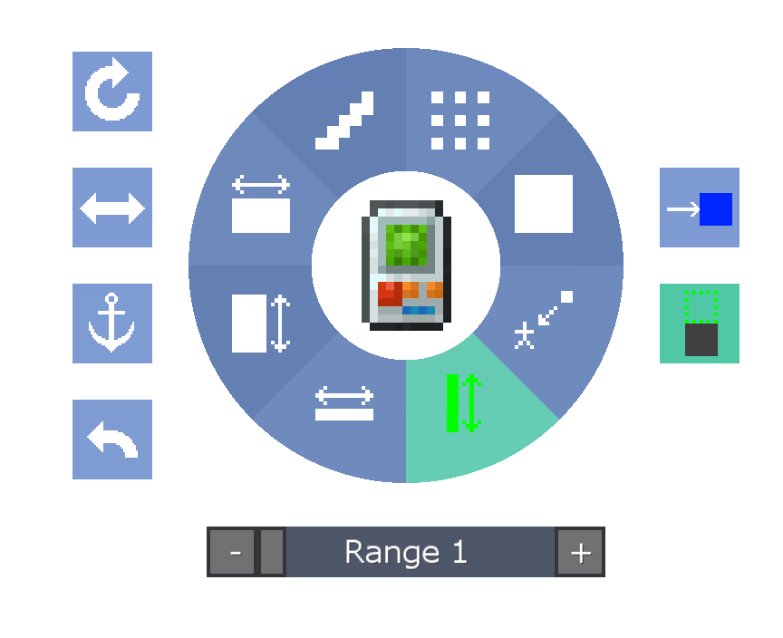

#Строительные гаджеты

Building Gadgets - это мод от Direwolf20, который добавляет несколько инструментов, которые значительно упрощают создание в Minecraft.
[Вы можете прочитать официальную вики для мода, нажав здесь](https://github.com/Direwolf20-MC/BuildingGadgets/wiki)
Все гаджеты нуждаются в RF для работы.

Удерживайте кнопку «Настройки» модов (по умолчанию G), чтобы открыть радиальное меню:

Радиальное меню имеет все различные настройки для инструментов. В Building Gadget каждая из кнопок на круге представляет собой отдельный режим здания, кнопки справа - это опции для этого режима здания, а кнопки слева - для управления миром.

Кнопка Якорь сохранит структуру там, где она была, когда кнопка была размещена, так что вы можете обойти ее и убедиться, что вы хотите, чтобы она была.

При создании гаджетов запоминаются последние 10 раз, когда они использовались, и вы можете отменить их с помощью кнопки Отменить.

Кнопка Повернуть будет вращать всю структуру или блоки внутри структуры, такие как Лестницы.
