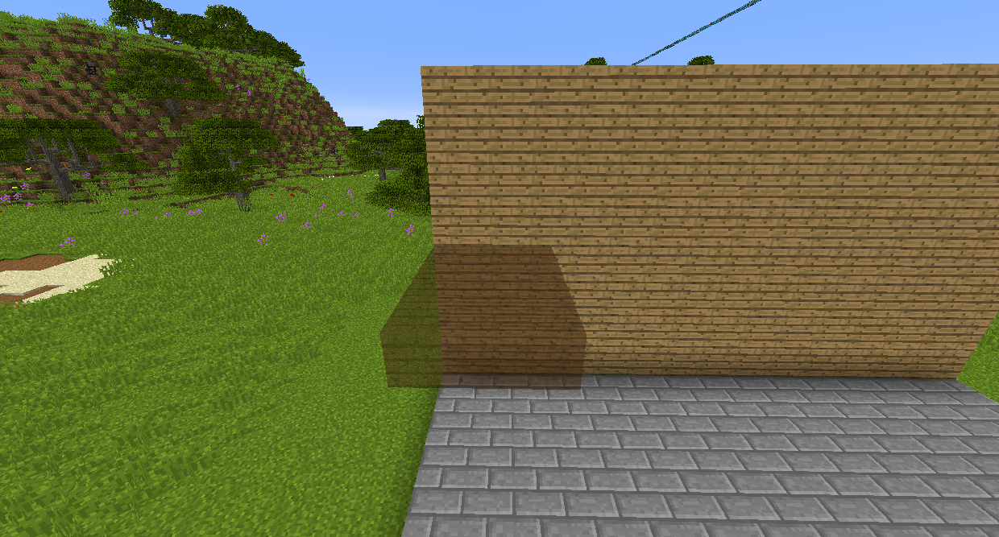
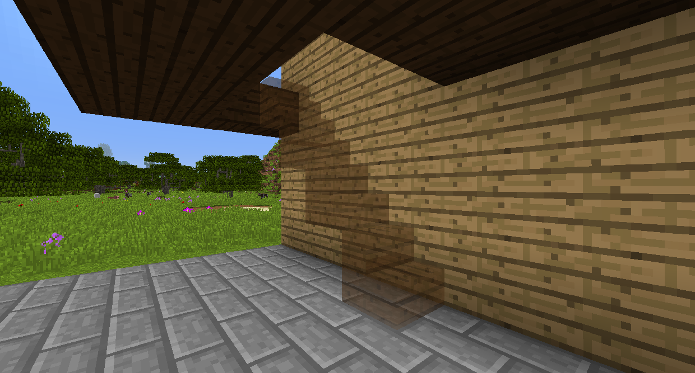
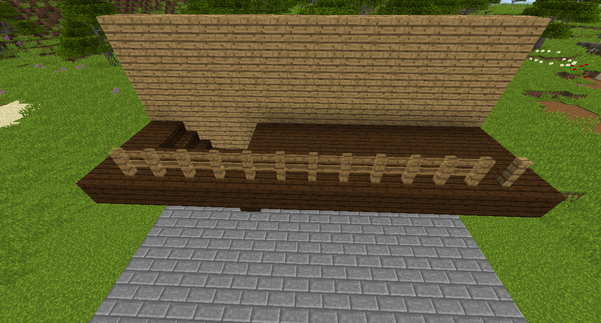
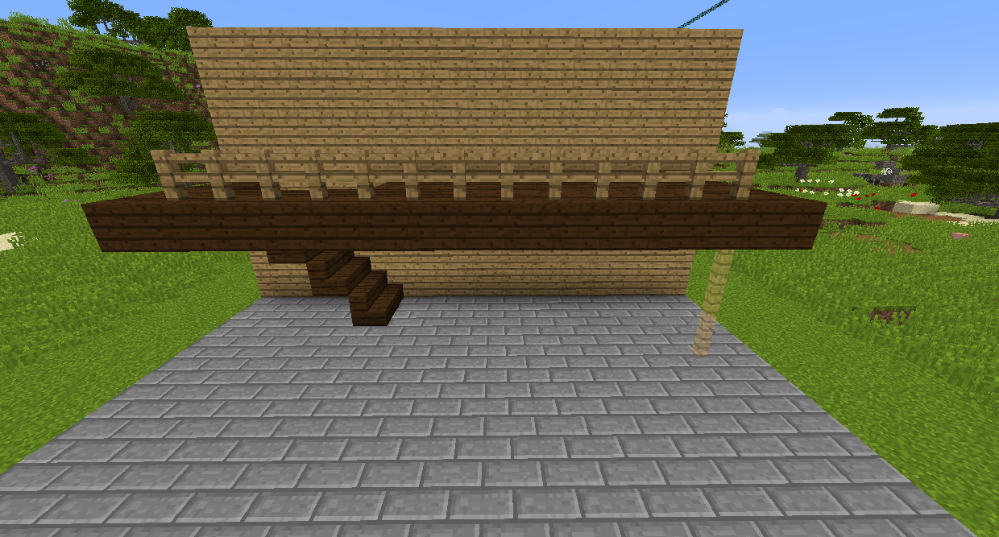

#Строительный гаджет

Строительный гаджет позволяет быстро создавать простые конструкции, такие как стены и лестницы.
Нажмите правой кнопкой мыши на блок, чтобы установить гаджет, чтобы построить этот блок, и щелкните правой кнопкой мыши, чтобы построить там, где отображается голограмма.

Режимы строительства

Режим Построить до меня будет пытаться создать прямую линию блоков от того места, куда вы указываете.

Режим сетки создаст сетку блока, который вы установили, в области, определенной диапазоном.

Режим вертикальной стены создает стену, длина каждой стороны которой определяется диапазоном. 

Режим горизонтальной стены создаст пол с длиной, определяемой диапазоном.

Режим Поверхность будет помещать блоки на каждый блок того типа, на который вы смотрите, с областью, зависящей от диапазона. Этот режим имеет дополнительные параметры. Включение параметра Нечеткий позволит ему работать на всех одинаковых блоках вместо одного и того же блока, поэтому, например, разные типы древесины будут учитываться как один и тот же блок. Соединенная поверхность потребует, чтобы все блоки касались их для размещения.

Режим Лестницы будет размещать блоки по диагонали вниз или вверх, в зависимости от того, находитесь ли вы над или под блоком.

Горизонтальная колонка разместит ряд блоков на противоположной стороне блока, на который вы смотрите. 

Вертикальная колонка разместит столб из блоков прямо вверх или вниз.