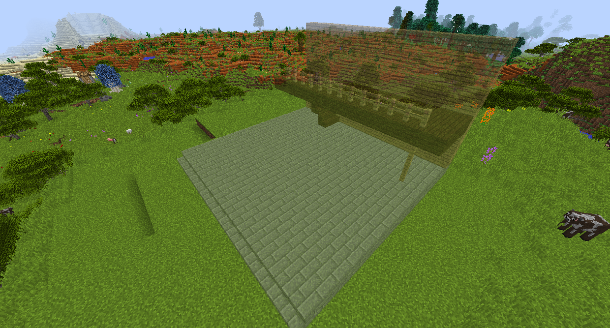

#Копировать-Вставить Гаджет

Гаджет «Копировать-Вставить» позволит вам скопировать область и разместить ее в другом месте, не разрушая оригинал. Вы также можете размещать конструкции, созданные другими людьми в Интернете!

Щелкните правой кнопкой мыши по одному углу области, которую вы хотите скопировать. В этом блоке он будет размещен позже. Нажмите правой кнопкой мыши на другой угол, чтобы скопировать прямоугольную область между ними.

Удерживая G, перейдите в режим вставки, и вы увидите голограмму скопированных блоков. Вы можете закрепить его где-нибудь, а затем удерживать скрытую кнопку и щелкнуть правой кнопкой мыши, чтобы вручную отрегулировать расположение структуры, если она вообще отключена.

Вы можете сохранить структуры в шаблонах.
Если вы не хотите получать все блоки для своей структуры, вместо этого вы можете использовать Строительную пасту!