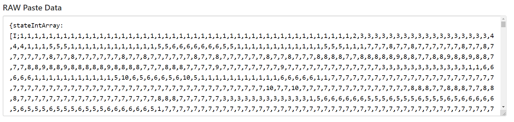

#Шаблоны
Шаблоны позволяют сохранять скопированные структуры в элементы, поэтому вы можете сохранить их, чтобы вставить их позже.

Диспетчер шаблонов - это то, где вы управляете шаблонами, как следует из названия.

Поместите гаджет в левый слот, а бумагу или шаблон - в правый.
Нажмите «Сохранить», чтобы записать данные структуры в гаджете на бумагу, создав шаблон. Вы также перезаписываете шаблоны вместо использования бумаги.
Нажмите «Загрузить», чтобы записать данные структуры в шаблоне в гаджет, что позволит вам вставить их в мир.

Нажмите «Копировать», чтобы скопировать данные структуры в гаджете в буфер обмена вашего компьютера. Вы можете опубликовать это онлайн или отправить кому-то из игры, и они смогут загрузить его.
Нажмите «Вставить», чтобы вставить данные структуры из буфера обмена вашего компьютера в «Бумагу» или «Шаблон» в правом слоте, чтобы вы могли загрузить их в гаджет.

[Вы также можете найти пользовательские структуры онлайн здесь!](https://www.reddit.com/r/9x9/)
Исследуйте эту страницу, найдите понравившуюся вам структуру и откройте сообщение, в котором она находится. Сообщение должно иметь ссылку pastebin.com, а внизу должно быть текстовое поле с надписью «RAW Paste Data». Выберите все в поле и скопируйте его.
