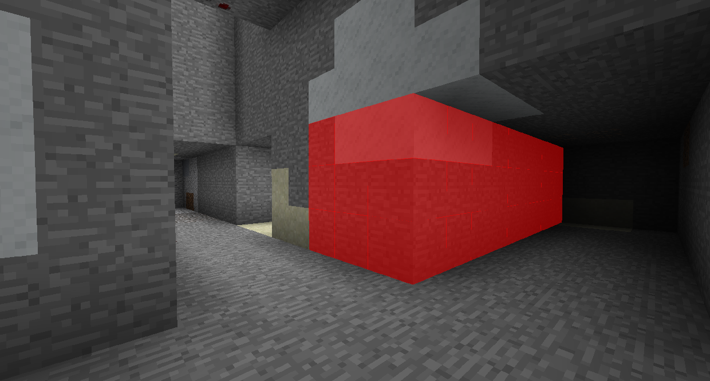

#Гаджет разрушения

Гаджет Разрушения позволяет вам уничтожать огромное количество блоков одновременно. Разрушенные блоки не удаляются, они исчезают навсегда (хотя вы можете отменить с U по умолчанию).

Нажмите правой кнопкой мыши, чтобы установить область, на которую это повлияет. Установите число в каждом направлении, чтобы сказать, сколько блоков в этом направлении оно сломает.

Если вы установите его так, что Вверх, Вниз, Влево и Вправо будут равны 1, то он будет разбивать 1 блок в каждом направлении от центра, преодолевая область 3x3.
