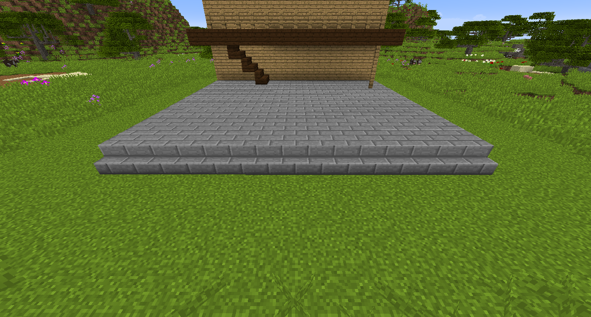

#Гаджет замены

Гаджет замены заменяет блоки в шаблонах, похожих на строительный гаджет. Нажмите правой кнопкой мыши на блок, который вы хотите заменить, установите режим и диапазон, а затем щелкните правой кнопкой мыши, чтобы заменить.

Если вы попытаетесь заменить блок, который не выпадает сам, как трава или камень, он отбросит блок, как если бы он был добыт инструментом. Вы можете зачаровать гаджет обмена с Шелковое касание, и он сам выпадет.