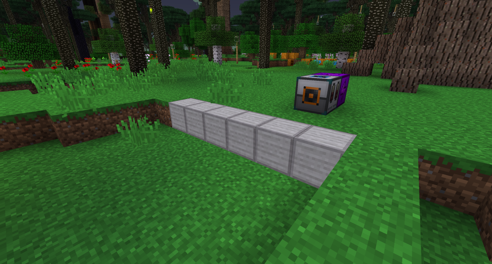
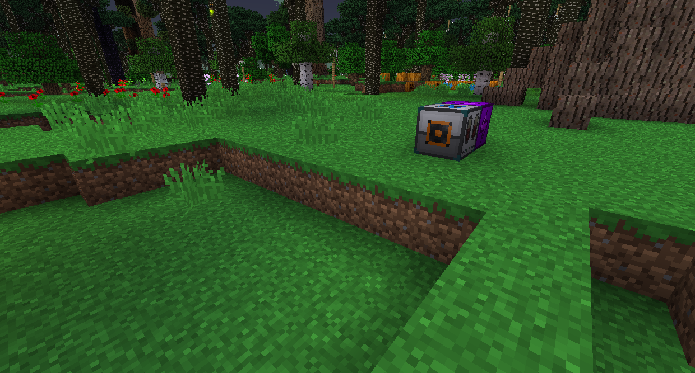

#Строительная паста
Строительная паста может выглядеть как любой блок, но она не будет имитировать какие-либо особенности. Гаджеты будут использовать Строительную пасту из вашего инвентаря, если у нее недостаточно фактического блока.

Чтобы получить Строительную пасту, поместите Строительный порошок рядом с водой, а затем разбейте получившийся блок. Вы можете сохранить его в контейнере для вставки, щелкнув его правой кнопкой мыши, пока у вас есть паста в вашем инвентаре.

