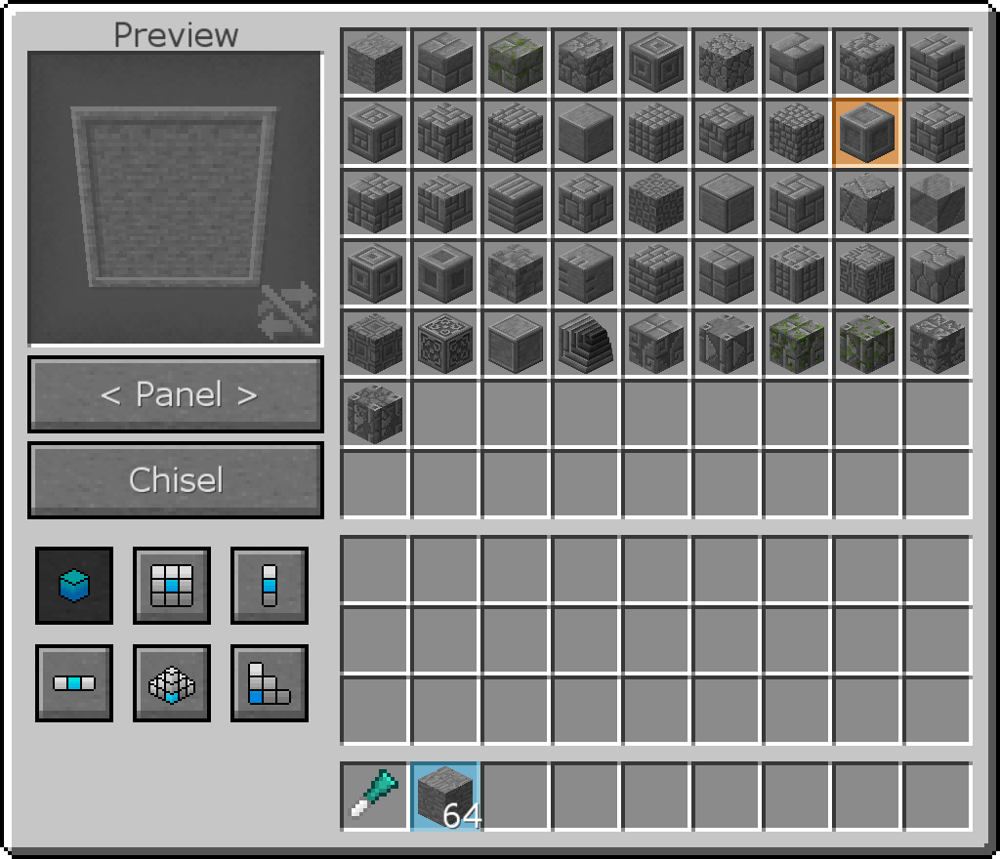

# Chisel

Мод Chisel добавляет огромное количество декоративных блоков и 4 инструмента, которые помогут сделать их.

Первое долото является самым основным. Откройте его, вставьте блок, и справа вы можете выбрать нужную версию. Если вы поместите точеный блок во входной слот, вы можете щелкнуть левой кнопкой мыши на долоте на блоках в мире, чтобы разрезать их без необходимости разбивать и заменять их.

Алмазное долото длится дольше и имеет больше возможностей для долбления блоков в мире. С помощью 4 кнопок слева вы можете выбрать зубило один блок, область 3х3, 3 вертикальных блока или 3 горизонтальных блока одновременно.

iChisel работает немного по-другому. Вместо того, чтобы вставлять блок и извлекать точеный блок, вы выбираете блок, который хотите стамесить, из своего инвентаря, а затем выбираете то, во что хотите превратить его справа. Слева вы можете увидеть, как будет выглядеть блок. Вы можете изменить форму блоков, нажав кнопку ниже. Вы можете щелкнуть Зубило, чтобы расточить выбранный вами стек, или пробраться сквозь дырку и щелкнуть, чтобы заколоть все блоки этого типа в вашем инвентаре одновременно. Есть также больше вариантов для долбления в мире.

Некоторые блоки имеют текстуры, которые порождают несколько блоков. Тем не менее, они могут быть не в центре, где вы хотите их видеть. В этом помогает Эндер офсетная стена.

Удерживайте Ender Offset Wand и посмотрите на блоки. Щелкните по нему в том направлении, в котором вы хотите сместить текстуры. Так что, если текстура на один блок слишком высока, щелкните по нижней части блока.

Авто Долото автоматически раскалывает блоки, которые вы вставите в него. Поместите долото в средний слот, поместите нужный вариант блока в средний нижний слот, а затем введите блоки в левую сторону, и они будут выведены в правую сторону.

