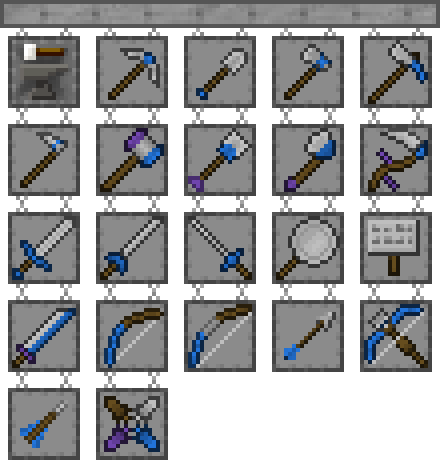

#Tinkers' Construct 2

Tinkers' Construct 2 позволяет игрокам создавать модульные инструменты и оружие. Смешивайте и подбирайте разные материалы и добавляйте модификаторы, чтобы создать идеальный инструмент.

Вы можете прочитать «Материалы и Вы» для подробного руководства по каждому инструменту, оружию, материалу и модификатору, добавленному модом.