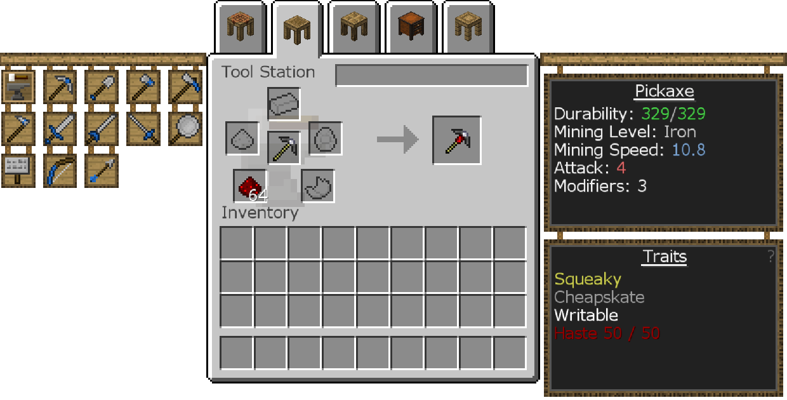

#Изготовление инструментов
Во-первых, вы захотите создать эти блоки.

Станция крафтинга работает как обычный стол крафта, но предметы останутся внутри, если вы оставите их до опустошения. Вы также можете увидеть инвентарь, касающийся этого, так же как и все другие блоки Tinkers' Construct в виде вкладок вверху.

Стол трафаретов превращает пустые трафареты в части инструментов, необходимые для создания инструментов. Поместите пустые трафареты в левый слот и нажмите на нужный узор слева, чтобы сделать его.

Вы можете хранить эти трафареты в сундуке трафаретов.

Компоновщик деталей - это место, где вы комбинируете трафарет и материал для создания инструментальной детали.

Нажмите кнопки слева, чтобы выбрать трафарет, а затем поместите материал в один из слотов рядом с ним. Текстовое поле справа обновится, чтобы показать статистику для этого материала для каждой части. Вы можете навести курсор на статистику, чтобы увидеть больше информации.

Вы можете изготавливать детали только из неметаллов в конструкторе деталей. Металлы нужны для плавильни, о чем будет рассказано позже.

Если Компоновщик деталей касается Сундука трафаретов, вы можете взять из него трафареты, не открывая его.

Станция инструментов - это место, где вы комбинируете детали для создания инструмента.

Нажмите на инструмент, который вы хотите создать слева, и поместите части инструмента в соответствующие слоты.
Правая сторона расскажет вам свои характеристики и характеристики в соответствии с частями, использованными для его изготовления.

Кирка на изображении ниже (сделанная из каменного оголовья кирки, бумажного переплета и губчатого инструментального стержня) может добывать железную руду и все, что «мягче», например, каменную руду и камень, но не что-то вроде алмаза или красного камня.
Вы можете дать ему имя, набрав в текстовом поле вверху.

Вы также можете добавить модификаторы в Станции инструментов, поместив готовый инструмент в средний слот на первой странице и поместив элементы модификатора в окружающие слоты.
Смотри Материалы и Вы для получения информации о том, какие модификаторы доступны для вашего инструмента.
Инструменты имеют ограниченное количество модификаторов. Оставшееся количество можно увидеть с правой стороны Станции инструментов, когда инструмент находится внутри нее.

Станция инструментов может создавать только ограниченную группу инструментов. Чтобы сделать больше, вам нужно создать и использовать Кузницу инструментов, которая работает точно так же, как и Станция инструментов, просто с большим количеством инструментов, доступных для создания. Вы можете сделать Кузницу инструментов практически из любого металлического блока, но разница только в эстетике.

Если навести курсор на инструмент в инвентаре, вы увидите модификаторы и статистику, а также уровень инструмента. Когда мод Tinkers' Tool Leveling установлен (который есть в этом модпаке), использование инструмента даст ему опыт. Повышение уровня инструмента даст ему дополнительный модификатор!

Вы можете менять детали инструмента, комбинируя полностью отремонтированный инструмент с той частью инструмента, которую хотите установить на него. Это избавит от части инструмента, которую вы заменяете, а также от любой предоставленной черты.

Если вы хотите повысить уровень майнинга инструмента, не меняя его характеристики или характеристики, вы можете использовать Набор для заточки. Это только изменит уровень майнинга инструмента, оставив все остальное в покое. Это не использует модификатор и может быть сделано несколько раз. Вы также можете изготовить их с помощью инструмента, чтобы починить его, если они оба сделаны из одного и того же материала.

Тиснение позволяет добавить черту инструментальной части к инструменту без замены инструментальной части. Так что, если вам действительно нравится внешний вид черты инструментальной части, но не нравится статистика, вы можете нанести эту инструментальную черту на инструмент, вместо того, чтобы заменять эту деталь на него!
