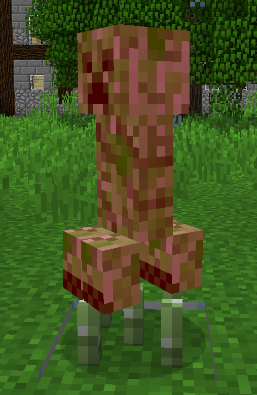
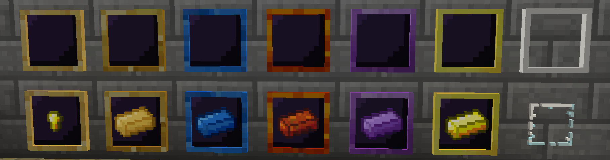
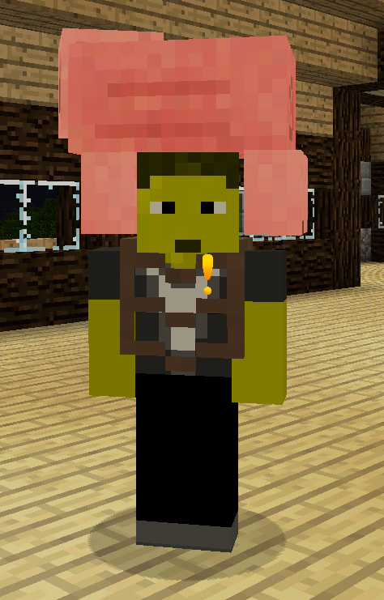
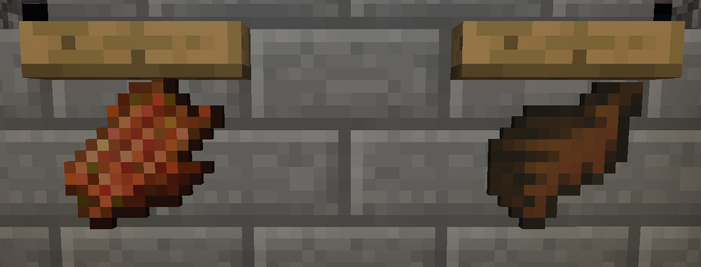
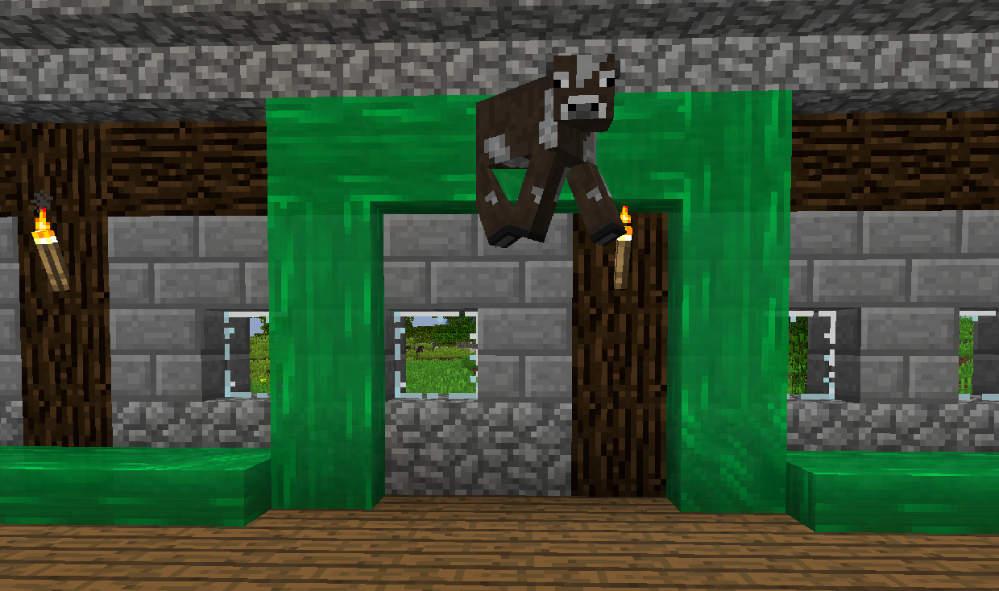
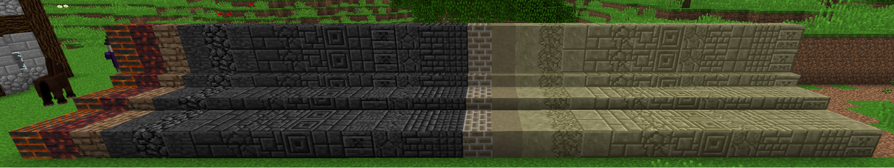

Tinkers' Construct также добавляет кучу других забавных вещей, которые не связаны с инструментами или оружием.

Слизневые сапоги заставит вас подпрыгнуть после приземления от падения, сводя на нет весь урон от падения. Вы можете красться, чтобы это не работало.

Удерживая правую кнопку мыши на Слизневой рогатке и нацелившись на блок, затем отпустите, и вы полетите в противоположном направлении. Настоятельно рекомендуется носить Слизневые сапоги перед использованием.

Каменный Факел и Лестница работают как обычный Факел и Лестница, но могут быть сделаны с использованием только тех вещей, которые вы можете найти во время майнинга!

Светящийся снежок - это брошенный снаряд, который помещает источник света туда, куда он приземляется.

EFLN - это метательный снаряд, который взрывается там, где он приземляется, разбивая блоки, но не предметы. Будьте очень осторожны с тем, где вы их используете, они очень разрушительны.

Палочки панджи - это размещенный блок, который быстро повреждает мобов, которые их касаются, а также применяет Медлительность II.

Есть множество новых рамок для предметов, которые работают точно так же, как и обычные, но выглядят красиво.

Щелкните правой кнопкой мыши Свинорюкзаком на моба, чтобы экипировать его, поместив его на голову. Освободите Свинорюкзак, чтобы положить моба.

Сушилка сушит определенные предметы, превращая их в другие предметы. Это в основном используется для превращения сырых продуктов в вяленое мясо. Вы также можете сушить некоторые готовые продукты в коже.

Каналы слизи работают как конвейерные ленты; они толкают сущностей, таких как предметы и мобы, в направлении их движения. Это включает в себя вверх, вниз и вдоль стен!
Каналы слизи не блокируют мобов от спавна, так что вы можете использовать их в мельницах, чтобы толкать их в тот момент, когда они спавнятся.

«Прозрачное стекло» - это именно то, что следует из названия, это стекло с более четкой текстурой. Прозрачные стеклянные блоки, которые соприкасаются друг с другом, потеряют границу, соединяющую их, поэтому вы можете иметь большие стеклянные панели без перекрещивающихся белых линий!

В Tinkers' Construct больше тонны декоративных блоков! Вбейте в поиск JEI "@Tinkers'Construct", чтобы увидеть полный список всего, что добавлено модом.
