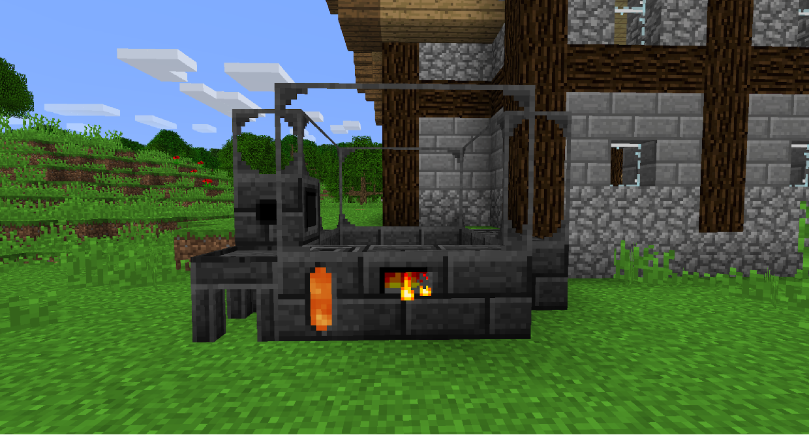
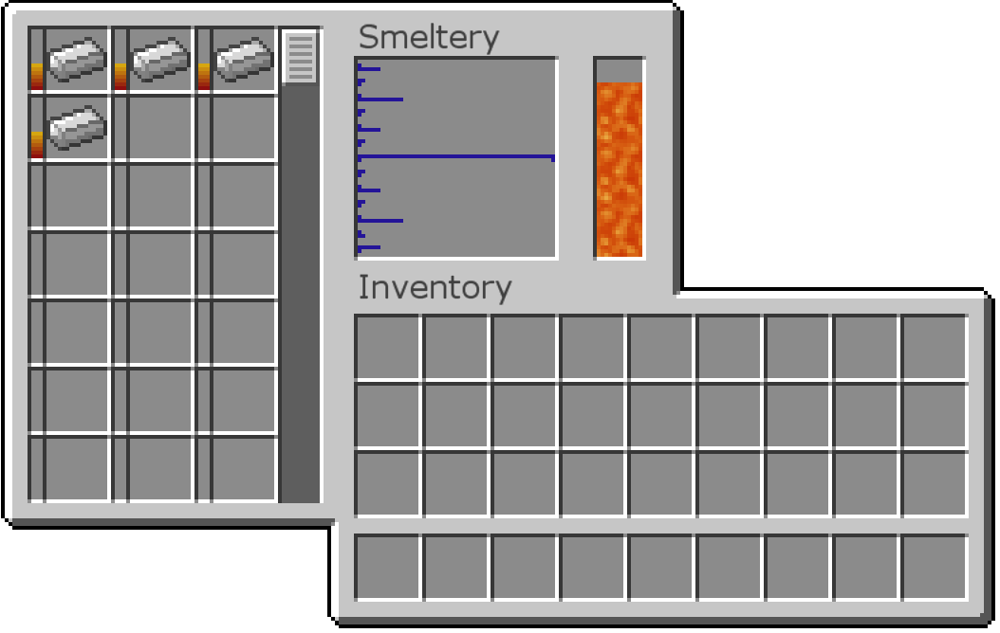
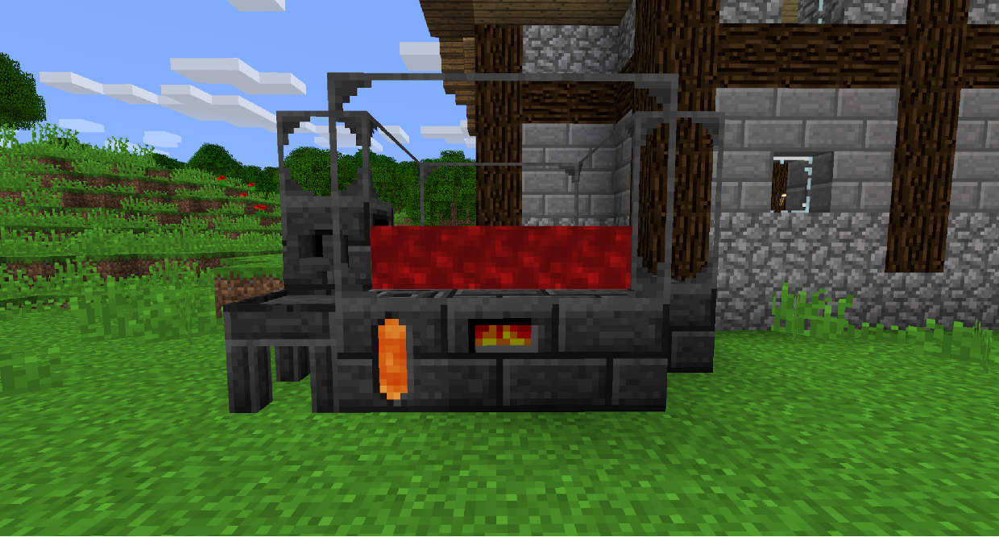
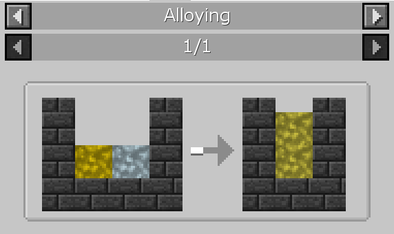
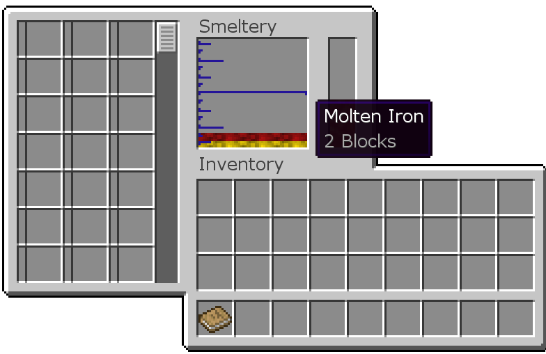
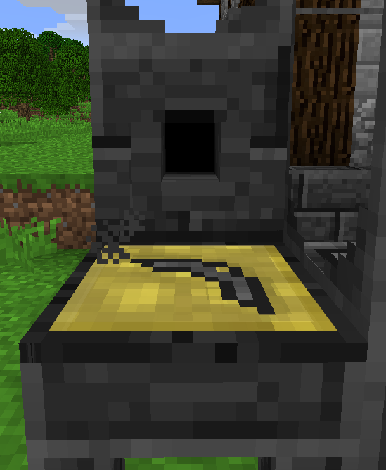
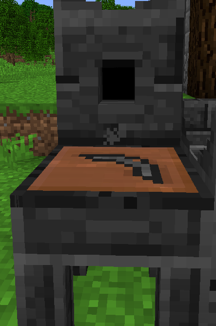
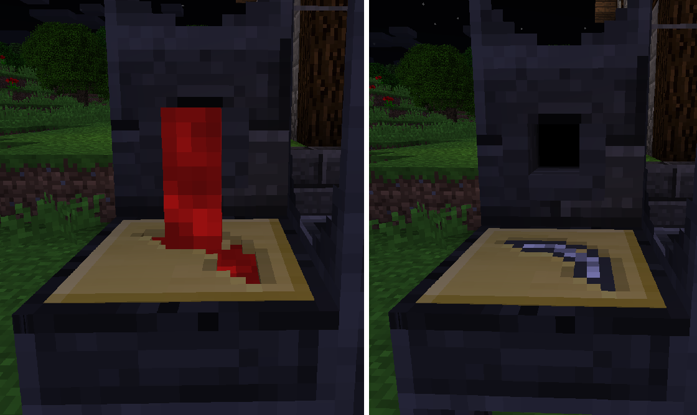

Плавильня представляет собой многоблочную структуру (то есть для работы ему требуется несколько блоков по определенному шаблону, например, как портал в Ад), которая используется для плавки металлов за счет лавы.

Чтобы построить плавильню, сделайте конструкцию, в которой все стены и пол будут сделаны из обожженного камня, кирпича, окон или почти любого другого обожженного блока.
Одним из блоков должен быть Контроллер плавильни, в который вы можете вставлять предметы.
Обоженный резервуар держит Лаву, чтобы питать плавильный завод.

Чтобы вставить/извлечь жидкости, плавильному заводу необходим слив для плавильного завода с присоединенным к нему краном (или любыми другими трубами).
Под Краном поместите Литейный стол (или Литейный резервуар, если вы хотите делать блоки вместо предметов).
Вы можете сделать плавильню любого размера, если он прямоугольный.
Чем больше блоков внутри плавильни, тем больше слотов доступно для использования.

Откройте контроллер плавильни, и вы сможете вставлять металлы. Если у него есть лава, он начнет нагреваться, а затем превратится в расплавленный металл. Один слиток обычно равен 144 мБ этого металла.

По умолчанию, плавящиеся руды дают вам расплавленного металла на два слитка, эффективно удваивая ваши руды. У некоторых модпаков это может быть отключено.

Определенные комбинации расплавленных металлов будут создавать сплавы. Если два расплавленных металла, которые находятся в плавильном цехе, могут сплавиться вместе, они будут плавиться, поэтому будьте осторожны с тем, какие металлы вы кладете в плавильный цех одновременно.

Недавно расплавленные металлы пойдут на вершину стека, а вещи внизу будут отлиты первыми. Вы можете щелкнуть на расплавленный металл, чтобы отправить его на дно, чтобы вы могли отлить его.

Чтобы сделать форму, сделайте инструмент из дешевого материала, который вы не против потерять, и поместите его на литейный стол. Расплавьте 2 слитка золота или 1 слиток алюминиевой латуни, а затем активируйте кран, чтобы вылить расплавленный металл на часть инструмента. Это создаст многоразовую форму для металлических деталей, разрушая инструментальную часть, которую вы использовали в процессе.

Вы можете сделать то же самое с 2 глиняными шариками, чтобы сделать глиняную форму, который ломается после одного использования, но намного дешевле.

Чтобы сделать металлическую деталь инструмента, поместите форму на литейный стол и активируйте кран, и расплавленный металл выльется в форму и затвердеет. Снова щелкните правой кнопкой мыши на литейном столе, чтобы извлечь металлическую деталь инструмента.

