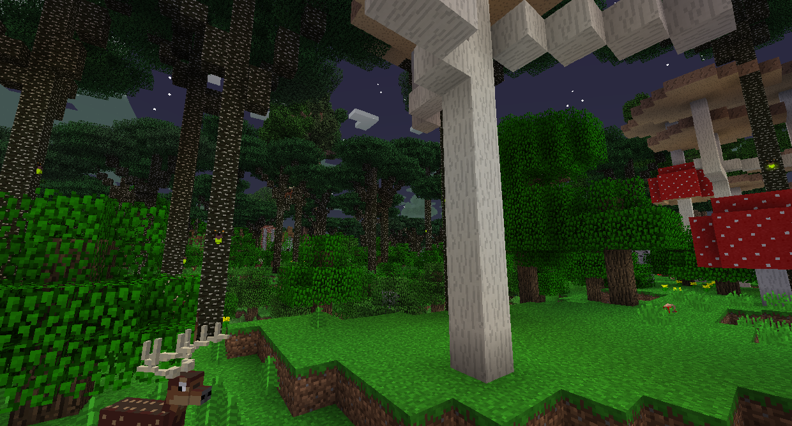
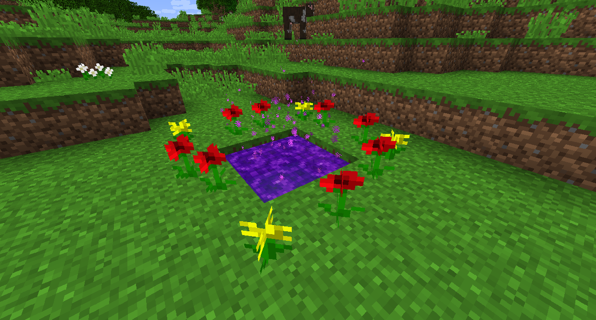

#Сумеречный лес

Сумеречный лес - это новое измерение для исследования, полное новых животных, монстров, строений и боссов.
Чтобы добраться туда, выкопайте 2x2 дыру в земле и заполните ее водой. Окружите его цветами, похожими на растения, и киньте туда Алмаз.

Было бы неплохо разместить путевую точку внизу портала с помощью B.

В Сумеречном лесу есть система прогрессии. Это означает, что некоторые биомы и структуры будут полностью заблокированы, пока вы не победите определенных боссов.
