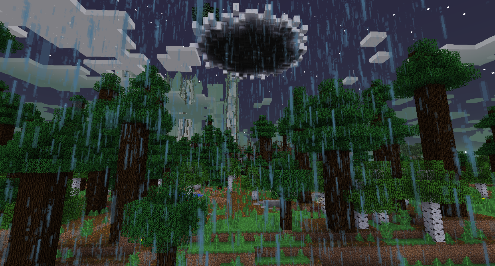
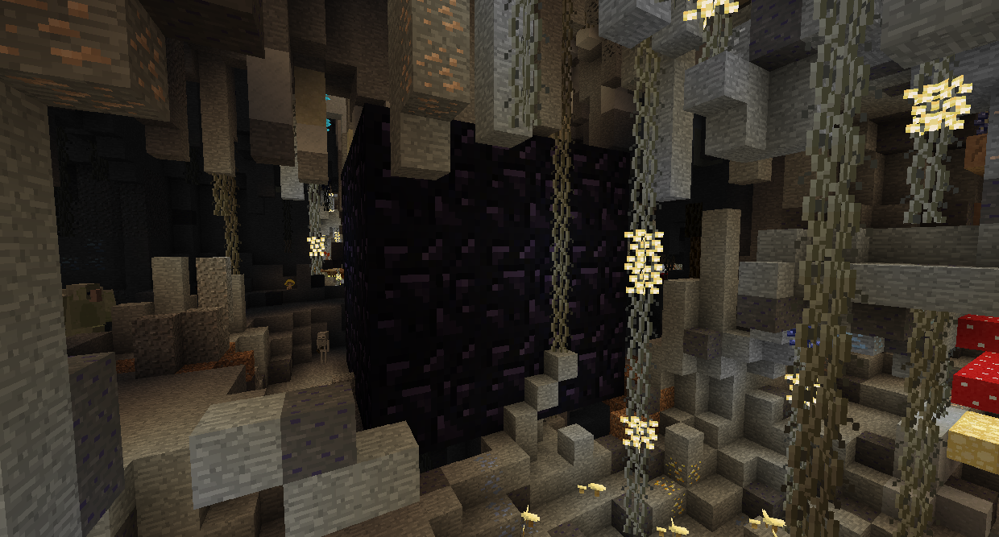

#Горные боссы

Если вы не победили Ур-Гаста, Гидру и Снежную Королеву, в Нагорье будет проливной кислотный дождь, наносящий тяжелый урон.

Перво-наперво, вам захочется уйти в подполье в пещерах Троллей. Там будет полно троллей, как следует из названия. Смертельные тролли осветят близлежащий Тролвидр, предоставляя естественный источник света.
То, что вы должны найти, это небольшое Обсидиановое хранилище. Покопайтесь в нем и заберите Плодородную почву и Волшебные бобы изнутри.

Вернитесь на поверхность и выйдите из-под Облачного Коттеджа. Положите немного Плодородную почвы и посадите Волшебный Боб. Поднимитесь на бобовый стебель до Облачного коттеджа.

Одолейте Гигантского Шахтера, чтобы получить гигантскую кирку, которая может добывать гигантские блоки. Вернитесь в пещеру Троллей и используйте Гигантскую кирку, чтобы пройти в Гигантское Обсидиановое хранилище и возьмите Лампу Гари.

Лампа гари позволит вам получить доступ к Терновым землям. Щелкните правой кнопкой мыши на шипах, чтобы сжечь их, чтобы пройти через них. Если вы не получили Лампу Гари, на Терновых землях будет кислотный дождь.

Как только вы добрались до замка, вы в общем-то все сделали. Сумеречный лес еще не завершен, и в настоящее время нет финального босса. Вы можете захватить замок и жить в нем, если хотите, но здесь нечего делать.