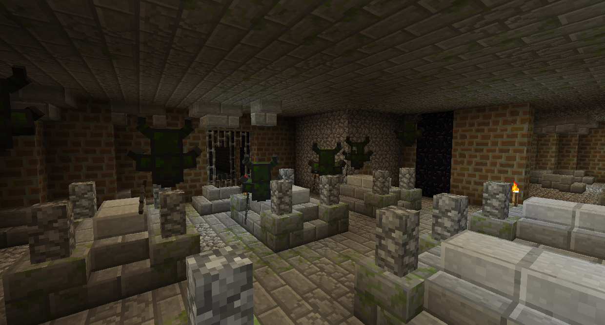

#Боссы Темного Леса

###Призраки Рыцарей

Призраки Рыцарей - это призраки в доспехах, которых можно найти на дне Крепостей Рыцарей Гоблинов, которые появляются в Темных Лесах. Вам нужно будет разместить любой трофей на пьедестале, чтобы войти в Крепость.

Если вы не убили и не разграбили Лича, у Темного Леса будут темные усики, которые дадут вам Слепоту.

Крепость Рыцаря Гоблинов раскидистая, полная добычи и врагов. В конце концов вы найдете склеп с шестью призрачными рыцарями. Они не застрахованы от любого урона, так что вы можете убить их так, как вам нравится.
Как только они все умрут, сундук с добычей появится в середине комнаты. Победа над Призрачным Рыцарем также позволит вам войти в Темную Башню в центре Темного Леса.

###Ур-Гаст

Ур-Гаст - это гигантский Гаст на вершине Темной Башни.

Если вы не убили Призрачного Рыцаря, в Центре Темного леса будет непроходимая метель, дающая чрезвычайную медлительность.

Темная Башня полна врагов и головоломок. Появившиеся блоки исчезнут на пару секунд после щелчка правой кнопкой мыши, что позволит вам пройти через них.

Некоторые головоломки могут включать в себя анти-строителей, которые не позволяют вам размещать или разбивать блоки в своей области. Разбитые блоки появятся снова быстро, но у вас есть небольшое окно, чтобы пройти. Пройдите к Анти-Строителю и разбейте его, чтобы завершить эту головоломку.

Вы в конечном итоге доберетесь до запертой двери. Чтобы пройти его, пройдите другие соединенные пути и найдите 4 ключа от башни. Возможно, вы не сможете добраться до определенных районов, поэтому вам придется построить пешеходную дорожку.

Переместите рычаги для забавного сюрприза!

На самой вершине Темной башни вы найдете Ур-Гхаст. У него есть три атаки: он может стрелять огненными шарами, вызывать дождь из слез дьявола и вызывать дьяволов. Дьяволы будут появляться вокруг ловушек Гаста, и убивать их возле ловушек, а затем подавать сигнал красной пыли с ближайшей нажимной пластины, будут ловить Ур-Гаста, если он находится над ловушкой, нанося критический урон. Используй оружие дальнего боя, чтобы убить Ур-Гаста.
Если убить Ур-Гаста, в центре арены появится сундук с добычей. Он будет содержать трофей Ур-Гааста, Карминит и Огненные слезы, что является одним из требований для входа в Горную местность.