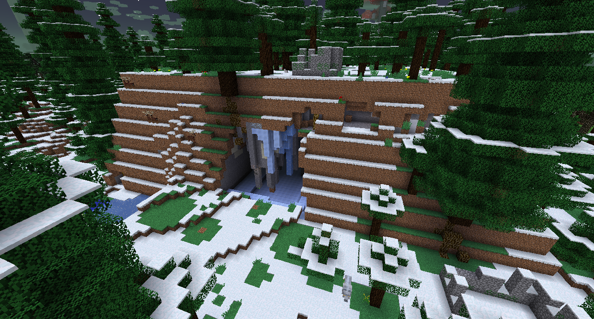
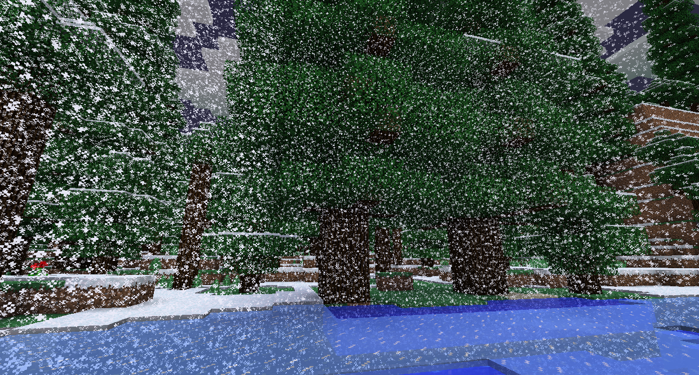
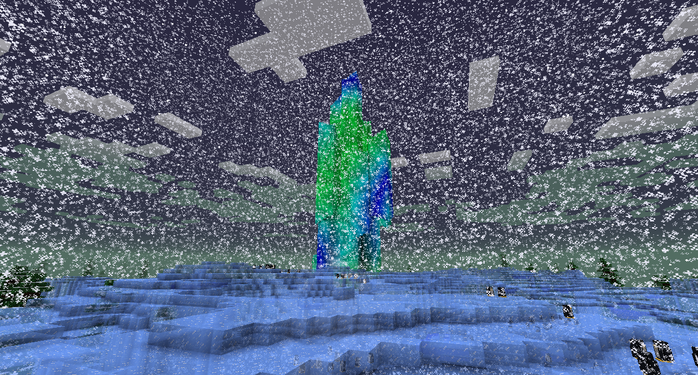
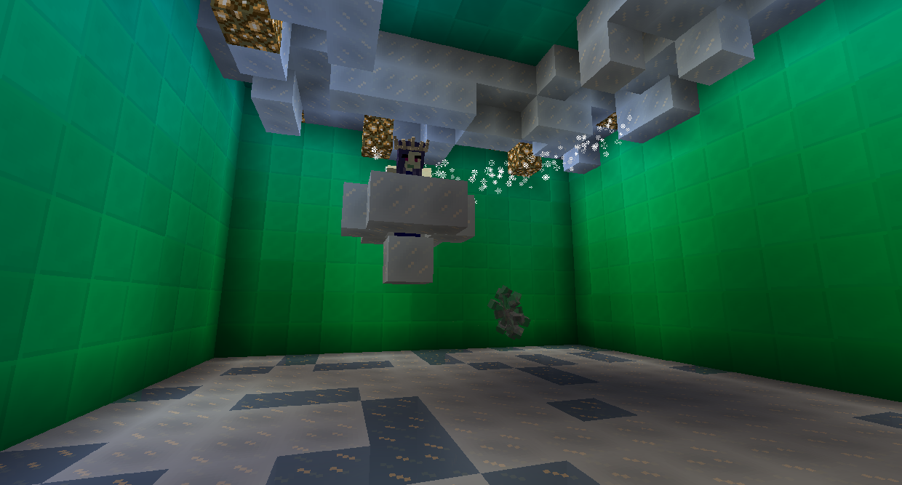

#Ледяные боссы

###Альфа Йети

Альфа Йети - крупный пушистый монстр, который можно найти в Логове Йети, которое появляется в Снежных Лесах.

Если вы не убили и не разграбили Лича, у Снежного Леса будет непроходимая метель, дающая чрезвычайную медлительность.

Вы можете найти Альфа Йети в центре Йети Ларс. Альфа-йети начнет с того, что бросит в игрока огромные глыбы льда, заморозив все, что находится рядом с ним. На этом этапе он будет блокировать все дальние попадания. Если игрок получает удар с близкого расстояния, он переходит на следующую стадию, прыгая вверх и вниз, в результате чего лед падает с потолка. Через 20 секунд он вернется к первому этапу.

После победы над Альфа-Йети он сбросит Ледяные Бомбы (которые позволяют бросать Лед, как Альфа-Йети), Арктический мех и мех Альфа-йети, который необходим для того, чтобы иметь возможность подняться на ледник.

###Снежная королева

Снежная королева находится на вершине дворца Авроры, на вершине ледника.

Если вы не убили и не разграбили Альфа Йети, у Ледника будет непроходимая метель, дающая чрезвычайную медлительность.

У Аврорского дворца есть различные враги на ледяной тематике, которые нужно победить. Снежная Королева наверху. Она едет на летающем облаке льда, которое блокирует повреждения от прохождения.
Снежная Королева может порождать мобов Ледяного Кристалла, врезаться в землю и скользить по земле, отстреливая ледяную магию. Используйте последние два хода как возможность нанести урон.

Победа над Снежной Королевой даст Тройной-Лук (который стреляет 3 стрелами) или Лук-Искатель (чьи стрелы попадают на врагов), а также Трофей Снежной Королевы. Победа над Снежной Королевой также является одним из требований для входа в Горную местность.