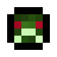
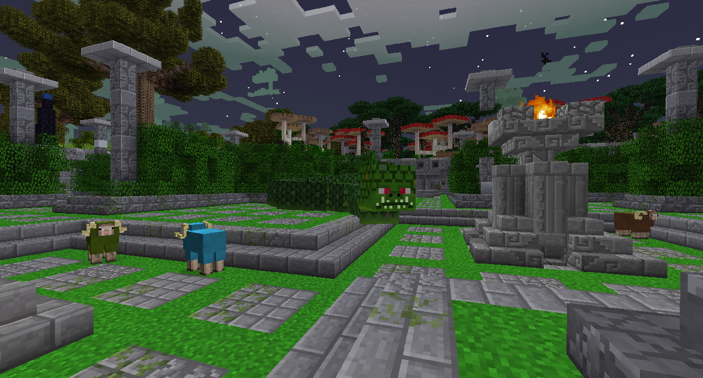
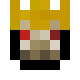
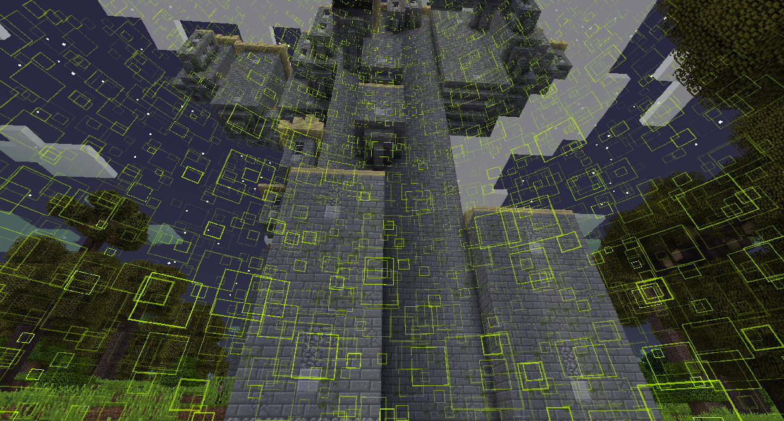
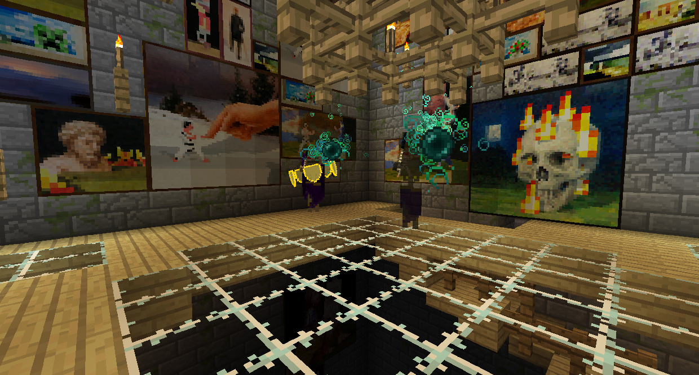

#Начальные боссы

###Нага

Нага - гигантская змея, которую можно найти во дворе Наги, которая появляется в большинстве лесных биомов.
Он будет преследовать вас и наталкиваться на вас, чтобы нанести ущерб. Вы можете повредить это, ударяя это где-нибудь. Когда он теряет здоровье, он становится короче. Специальной стратегии не требуется, просто ударь ее, пока она не умрет.

Нага сбросит Весы Наги и Трофей Наги. Подняв их, вы получите доступ к Башне Личей.

###Лич

Лич - это король-скелет, который можно найти в Башне Личей, которая появляется в большинстве лесных биомов.

Если вы не убили и не разграбили Нагу, башня будет защищена магией. Мобы не смогут получать урон, а блоки не смогут быть разбиты.

Вы можете найти Лича на вершине башни.

Битва с Личем состоит из трех этапов:
На первом этапе Лич будет противостоять всем повреждениям и атакует вас двумя миньонами. Синие снаряды можно отражать на Лича, чтобы разбить его щиты, а оранжевые снаряды взрываются.
Как только все его щиты опустятся, Лич начнет порождать Зомби, чтобы атаковать вас.
Убейте всех Зомби, и Лич начнет атаковать вас с помощью золотого меча. Теперь он может получать урон.

После того как вы убьете и разграбите Лича, вы сможете получить доступ к биомам Сумеречного болота, Темного леса и Снежного леса.

При победе из Лича выпадет один из 4 Скипетров.

Сумеречный скипетр позволит вам стрелять теми же синими снарядами, которые использовал лич в первой фазе. Каждый снаряд наносит 3 сердца урона. Скипетр можно использовать 99 раз, прежде чем его нужно будет зарядить Жемчугом Эндера.

Скипетр жизни истощает истощает здоровье любого моба и дает это здоровье игроку, использующему его. Его можно использовать 99 раз перед тем, как его перезарядить Маринованным паучьим глазом.

Зомби-Скипетр породит Лояльного Зомби, подобного тем, которых порождает Лич. Через некоторое время Верные Зомби начнут гореть, пока не умрут. Его можно использовать 9 раз, прежде чем его можно будет перезарядить Гнилой плотью и Зельем силы II.

Скипетр укрепления будет призывать щиты вокруг игрока. Эти щиты заблокируют весь физический урон, но впоследствии сломаются. Его можно использовать 9 раз, прежде чем его необходимо будет зарядить Золотым яблоком.