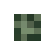
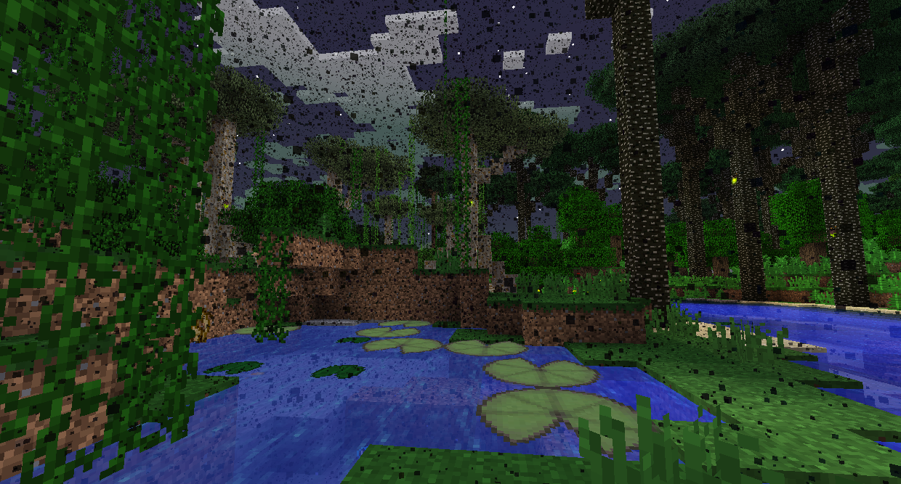

#Болотные боссы

###Минотавр

Минотавр - это грибной Минотавр, которого можно найти на дне Лабиринтов, которые появляются в Сумеречных Болотах.

Если вы не убили и не разграбили Лича, Сумеречный Лес будет полон комаров, которые нападут на вас и дадут вам Голод.

Внутри Лабиринта вы можете найти Минотавров, Слизней Лабиринта и Жуков Огня и Слизи. У минотавров есть шанс сбросить фокус карты лабиринта, который можно встроить в карту лабиринта, что значительно облегчает навигацию по Лабиринту. Они также могут создавать Столы раскрафта, которые позволяют вам отменить крафт предмета и обратно получить его базовые ингредиенты.
Лабиринт сделан из Камня лабиринта, который очень медленный для ломания. Есть также ловушки и много лута, так что не забудьте захватить то, что вы можете взять с собой.

Внизу Лабиринта вы можете найти Минот. Он имеет очень большое количество здоровья и наносит значительный урон, так что будьте готовы к бою. Там нет особой тактики, просто продолжайте наносить удары.

Убийство Минотавра принесет вам Трофей Минотавра и Суп из него, а также сокровища в сундуках. Съешьте Суп из минотавра, чтобы войти в Огненное Болото в центре Сумеречного Болота.

###Гидра

Гидра - это гигантский многоголовый дракон, который дышит огнем и появляется в Логове Гидры, которое находится в центре Огненных Болот.

Если вы еще не ели Меф Строганов, Огненное Болото будет слишком горячим, чтобы вы сгорели, если попытаетесь пройти.

Гидра будет атаковать, стреляя в вас или стреляя из взрывных бомб. Она может получить урон только из-за того, что её попали в открытый рот, поэтому попытайтесь соблазнить ее вдохнуть в вас огонь.

После победы из Гидры выпадут Мясо Гидры, Трофей Гидры и Огненная Кровь, что необходимо для получения доступа в Горную местность.