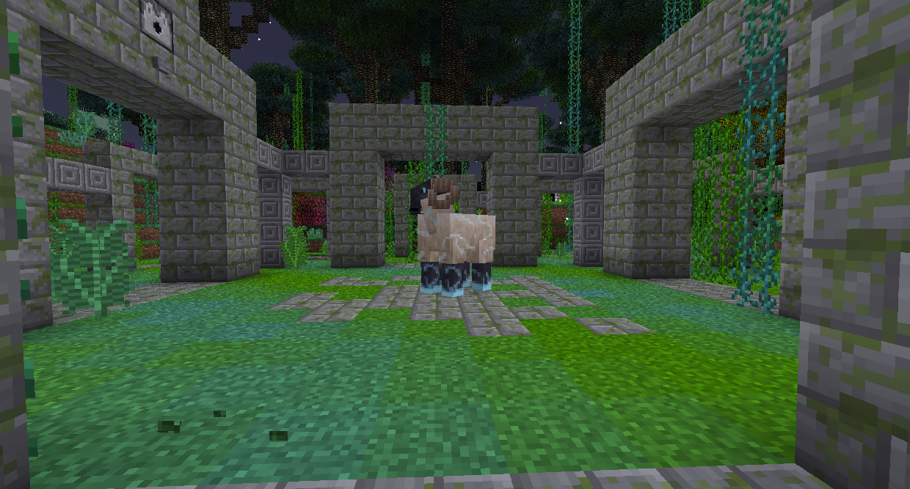

#Нян-баран

Нян-баран - пассивный босс, найденный в Квестовой роще, которая появляется в биоме Заколдованного леса.

Вместо того, чтобы убивать Нян-барана, вы должны дать ему по одному цвету шерсти. В качестве награды вы получите блок из ляписа, железа, золота, алмаза и изумруда каждый. Это также даст Рог изобилия, что превратит камень в булыжник, в гравий, в грязь.
