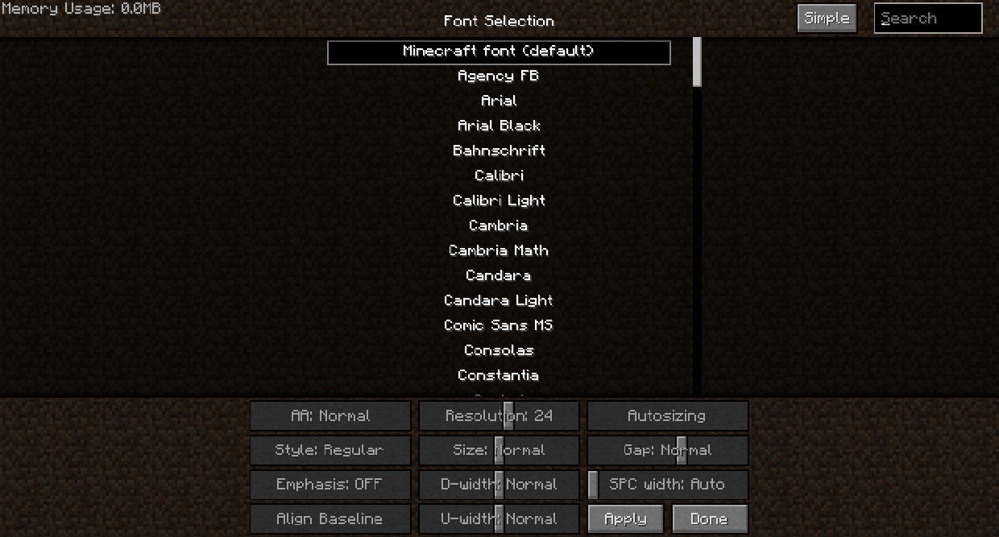

# Текстовый шрифт

FTB Academy (и большинство других модпакетов FTB) включает в себя мод Smooth Font, который помогает улучшить внешний вид шрифта. Он также изменяет шрифт по умолчанию с блочного текста на более гладкий (по умолчанию Verdana).

Вы можете нажать клавишу Home, чтобы открыть меню настроек Smooth Font, где вы можете выбрать любой другой шрифт, включая обычный шрифт vanilla blocky.

