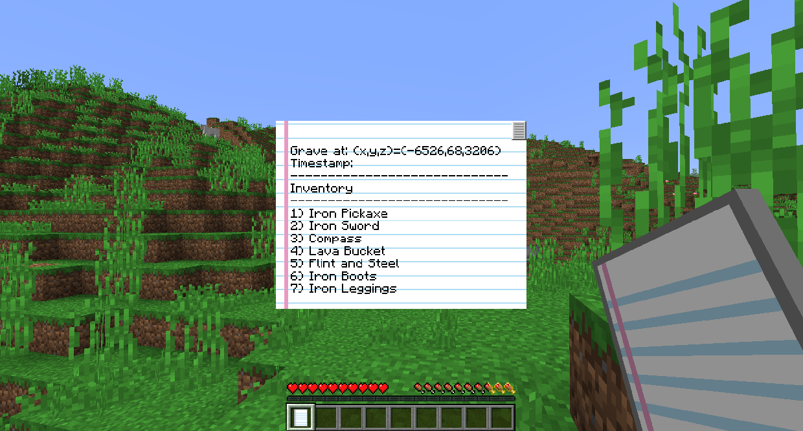
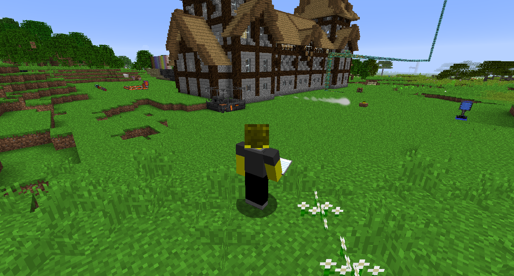
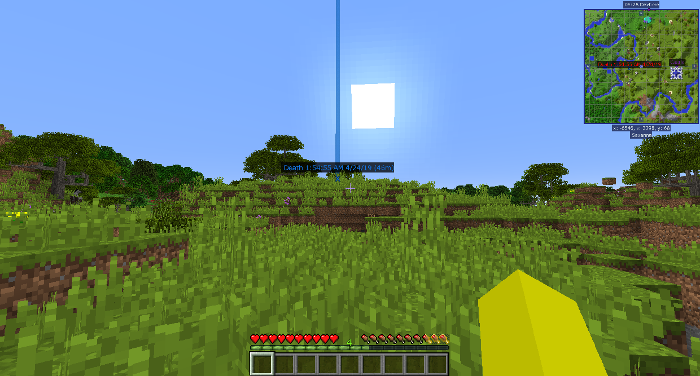

#Надгробия

Мод Tomb Many Graves делает так, что когда вы умираете, в мире, где вы умерли, помещается Могила игрока. Вы можете вернуться к нему и подкрасться, стоя на нем, чтобы вернуть все предметы, которые у вас были в инвентаре, на свои первоначальные места.

Когда вы возродитесь, у вас будет список инвентаря смерти, который расскажет вам все, что было в вашем инвентаре, когда вы умерли, а также где находится ваша могила. Когда вы окажетесь поблизости, удержание списка инвентаря смерти укажет вам направление на вашу могилу.

Journeymap создает точку смерти в месте, где вы умерли, чтобы вы могли легко найти ее. Вы можете увидеть это на мини-карте и карте мира, а также выглядеть как обычная точка в мире.